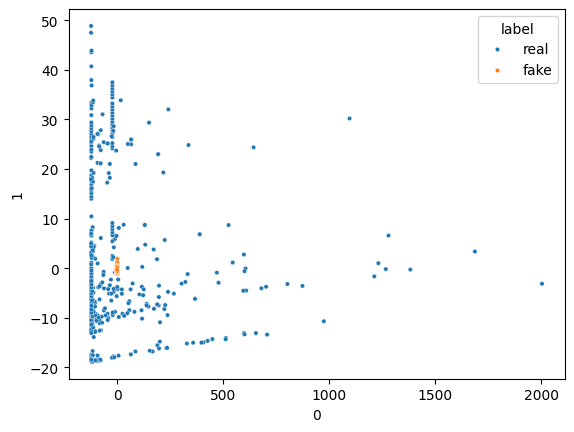

# Data Balancing : Fraud Detection using Generative Adversarial Networks (GANs)


## Introduction

The project aims to explore the application of Generative Adversarial Networks (GANs) in fraud detection using credit card transaction data. By leveraging GANs, we seek to generate synthetic fraudulent transactions to address the challenge of imbalanced datasets commonly encountered in fraud detection tasks. The project involves several key steps, including data preprocessing, model architecture design, training and evaluation, and generation of synthetic data for analysis.

* Accuracy Score for Generative AI: 0.936

## Project Outline

- Load the Dataset
- Preprocess and Explore the data
- Create the Generator model
- Practice Task - Data Preprocessing for Neural Networks
- Create the Discriminator model
- Combine Generator and Discriminator models to Build The GAN
- Train and evaluate our GAN
- Generate synthetic data using the trained Generator
- Principal Component Analysis for Data visualization

## Importing the Modules

```python
# Importing necessary modules and libraries
import numpy as np
import pandas as pd
import tensorflow as tf
import seaborn as sns
import matplotlib.pyplot as plt
import plotly.express as px
from sklearn.preprocessing import StandardScaler
from sklearn.decomposition import PCA
from tensorflow.keras.layers import Input, Dense, BatchNormalization
from tensorflow.keras.models import Model, Sequential
from tensorflow.keras.optimizers import Adam
from tensorflow.keras.utils import plot_model
from tensorflow.keras.callbacks import TensorBoard
from sklearn.utils import shuffle
```

## Importing the Data

```python
# Load the dataset
data = pd.read_csv('/content/Creditcard_dataset.csv')
data.head()
```

Check the data shape:

```python
data.shape
```

Remove rows with NaN values:

```python
data.dropna(inplace=True)
data.shape
```

Remove the 'Time' column:

```python
data = data.drop(axis=1, columns='Time')
data.head()
```

Feature scaling of the 'Amount' column:

```python
scaler = StandardScaler()
data['Amount'] = scaler.fit_transform(data[['Amount']])
data.head()
```

Let's split the genuine and fraudulent records into separate dataframes:

```python
data_fraud = data[data['Class'] == 1]
data_genuine = data[data['Class'] == 0]
data.head()
```

Split the data into features and labels:

```python
X = data.drop('Class', axis=1)
y = data['Class']
```

## Data Exploration

Apply PCA to reduce the dimensionality of features 'X' into two dimensions:

```python
pca = PCA(n_components=2)
transformed_data = pca.fit_transform(X)
df = pd.DataFrame(transformed_data)
df['label'] = y
df.head()
```

Use a scatter plot to visualize the data:



## Building the Generator Model

Define a method to create the Generator model architecture:

```python
# Generator model architecture
def build_generator():
    model = Sequential()
    # Define layers
    ...
    return model

# Build and visualize the generator model
gen = build_generator()
plot_model(gen, to_file='generator_model_plot.png', show_shapes=True, show_layer_names=True)
```

## Building the Discriminator Model

Define a method to create the Discriminator model architecture:

```python
# Discriminator model architecture
def build_discriminator():
    model = Sequential()
    # Define layers
    ...
    return model

# Build and visualize the discriminator model
disc = build_discriminator()
plot_model(disc, to_file='discriminator_model_plot.png', show_shapes=True, show_layer_names=True)
```

## Combine Generator and Discriminator Models to Build The GAN

```python
# Combine Generator and Discriminator models to build the GAN
def build_gan(generator, discriminator):
    ...
    return gan

# Build and visualize the GAN model
gans = build_gan(generator, discriminator)
plot_model(gans, to_file='gan_model_plot.png', show_shapes=True, show_layer_names=True)
```

## Train and Evaluate our GAN

```python
# Train and evaluate the GAN
...
```

## Generate Synthetic Data using the Trained Generator

Generate synthetic data using the trained generator:

```python
# Generate synthetic data using the trained Generator
synthetic_data = generate_synthetic_data(generator, 1000)
...
```

Checking the individual feature distribution of synthetic and real fraud data:

```python
# Plot histograms for feature distribution
...
```

## Model Evaluation

Calculate the accuracy score for Generative AI:

```python
# Calculate accuracy score for Generative AI
...
```
Accuracy Score for Generative AI: 0.936

## Conclusion

In this project, we have demonstrated the application of Generative Adversarial Networks (GANs) in fraud detection, specifically in generating synthetic fraudulent transactions to balance imbalanced datasets. By leveraging advanced techniques in machine learning and neural networks, we aim to enhance the accuracy and effectiveness of fraud detection systems, contributing to a safer and more secure financial environment.

```
